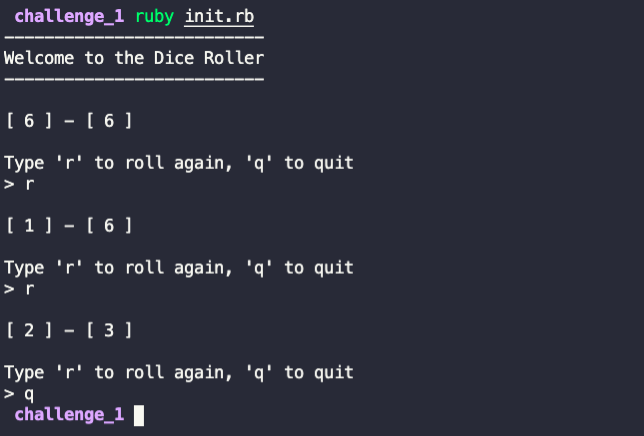

# Dice Challenge

- Model a set of dice that can be rolled and display the dice value
- Create a class representing DiceSet and each instance of the DiceSet should countain 2 instances of Dice class
- DiceSet#roll should roll both dice
- Rolling a dice means picking a random number between 1 - 6
- DiceSet#display should display the value of both dice
- Create a ruby script which should:
    - Have an introduction text
    - Loop that gets user input
    - The user should type 'r' to roll the dice again, 'q' to quit 

## Output

## Tips and Hints
- You can use the method `rand(6)` to get a random number when rolling the dice. 
- While modeling the classes you can use **irb** to test them. Use `require_relative` to load the classes in irb 
- Use the following file organisation to implement your solution:
    - create the DiceSet and Dice classes in separate files in the classes folder
    - add the ruby script in the init.rb file in the main folder of the project
    - use `require_relative` to load the class files in the init script